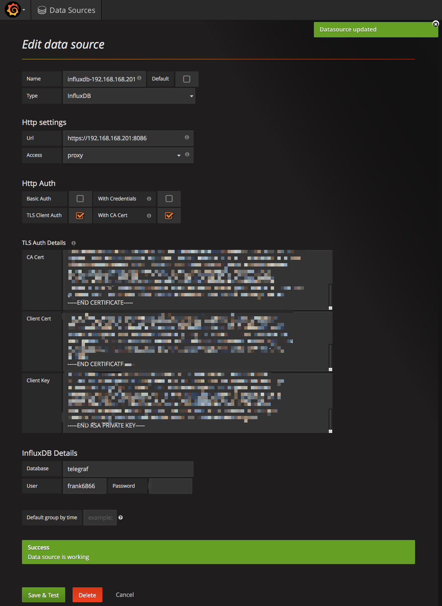
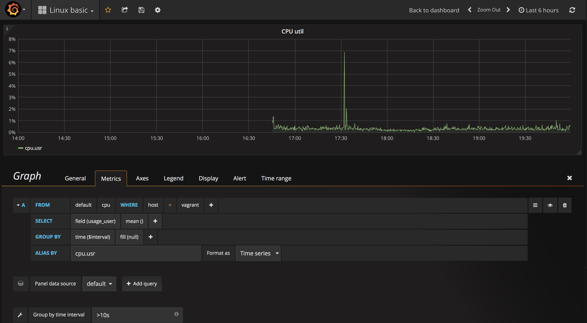

# Grafana Tutorial
本文的主要内容:  

* Grafana添加InfluxDB数据源(InfluxDB启用了auth并使用HTTPS)的相关配置
* 在Grafana中添加一个Dashboard用来展示Linux的基础监控(比如CPU、内存、网络、磁盘等)
* 在Dashboard中添加Graph，展示某个具体的监控想，比如CPU监控图表
* 通过模板变量在一个Dashboard切换不同主机的监控图，或多个主机的监控图一起显示


## 添加InfluxDB数据源

添加InfluxDB数据源相关的配置:

* Name: 数据源的名称，自定义的值，比如influxdb-192.168.168.201
* Type: 选择InfluxDB
* Default: 将该数据源设置为默认的数据源，这样有一个好处是，在添加panel的时候，会自动使用这个数据源。

Http settings:

* Url: InfluxDB的HTTP endpoint，比如: https://192.168.168.201:8086
* Access: direct表示url is used directly from browser；proxy表示Grafana backend will proxy the request。这里选择proxy。


Http Auth:

* Basic Auth: 是否使用HTTP basic认证，我们没有用到，就不勾选了。
* TLS Client Auth: 如果InfluxDB启用了https，需要证书内容(PEM格式)粘贴到TLS Auth Details的Client Cert中，将密钥内容(PEM格式)粘贴到TLS Auth Details的Client Key中
* With CA Cert: 如果证书是是自建CA签发或者自签的，需要将CA的证书内容(PEM格式)粘贴到TLS Auth Details的CA Cert中


InfluxDB Details:

* Database: InfluxDB中的数据库名称，比如telegraf
* User: InfluxDB中的用户名
* Password: InfluxDB中用户对应的密码


相关配置如下图:




## 添加Dashboard
找到新建Dashboard的菜单，Command+S然后输入名称就新建了一个Dashboard。在这里新建一个名为"Linux basic"的Dashboard。

## 添加row
row是panel的容器

## 添加Graph
添加一个类型为Graph的panel。

## Graph配置
点击Graph的标题，再点击"Edit"，可以打开Graph的配置页面:  

### General标签
* Title: 表示图表的名称，比如, 设置为"CPU util"
* Description: 图表的描述信息

### Metrics标签
首先设置"Panel data source"，如果上面添加的数据源被设置为Default，在Panel中就不需要设置了；如果上面的数据源没有被设置为Default，就需要手动设置数据源。

"Group by time interval"设置的是根据时间分组的秒数，这个值要大于telegraf数据采集的时间间隔(10s)，比如一般设置为">10s".


#### query
在Metrics中，每一个query都表示一条线。

query的组成:  

* FROM: "select measurement"表示选择InfluxDB中的哪个measurement，这里我们选择cpu
* WHERE: "WHERE"是根据tag key和tag value过滤的，这里我们选择tag key为host，tag value随便选一个，这里我选择的是vagrant
* SELECT: field(value)表示显示哪一个cpu表中哪个指标，这里我们选择"usage_user"，后面的mean表示group by表示的这段时间内的平均值。
* GROUP BY: 表示分组，这里按照时间分组，设置为time($interval)和fill(null)
* ALIAS BY: 这条线的legend名称，比如设置为cpu.usr


#### 帮助信息
在Metrics标签的最下面有三个帮助信息可以参考:  

* alias patterns
* stacking & fill
* group by time  

### Axes标签
在Axes中可以设置坐标轴的单位，cpu利用率的单位是%，设置方法如下:  

LeffY - Uint - none - percent(0-100)

> Grafana中,Unit表示的是查询出来的数据的单位,设置好后,Grafana会自动显示成合适的单位。比如原始数据的单位是bytes,数字是1024,在Grafana中会根据值自动在坐标轴上显示成1K,方便阅读。

> 还有一点注意的是,对于百分数,如果查询出来的是0-1之间的值,将percent设置为(0-1);如果查询出来的是0-100之间的值,将percent设置为(0-100)。对于百分比,Grafana在坐标轴中总是显示0-100%,所以将原始数据的单位设置好才能够正确地显示。


设置完后，效果图如下:  




# 使用模板
## 定义模板变量
这里以InfluxDB(使用Telegraf采集)数据源为例，配置主机名变量
点击Dashboard上方的小齿轮('Manage dashboard' -> 'Templating' -> 'New')

Variable部分

* Name: 变量的名称(在查询条件中显示,这里设置为server_name)
* Label: 变量的标签名(在页面上过滤时显示,这里设置为主机名)
* Type: 设置为Query
* "Query Options" -> "Data Source"：选择我们配置的数据源
* "Query Options" -> "Refresh"：选择"On Time Range Change"
* "Query Options" -> "Query"： 查询主机名，输入 SHOW TAG VALUES ON "telegraf" WITH KEY = "host"
* "Selection Options" -> "Multi-value": 勾选中

## 使用模板变量
以CPU为例

```
FROM default cpu WHERE host =~ /^$server_name$/
SELECT field(usage_user) mean()
GROUP BY time($interval) tag(host)
cpu.usage($tag_host)

```


