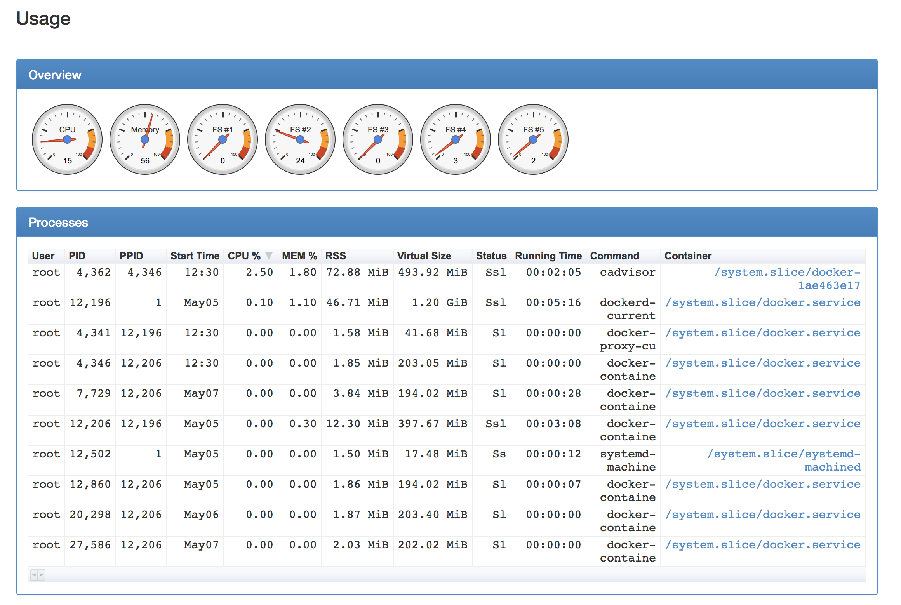

# cAdvisor
cAdvisor是Google提供一套容器监控工具


cAdvisor的使用很简单,在宿主机上启动一个cadvisor的容器就可以了,如下:

```
# docker run \
  --volume=/:/rootfs:ro \
  --volume=/var/run:/var/run:rw \
  --volume=/sys:/sys:ro \
  --volume=/var/lib/docker/:/var/lib/docker:ro \
  --publish=8080:8080 \
  --detach=true \
  --name=cadvisor \
  google/cadvisor:latest
```

然后在浏览器中打开 http://IP:8080 就可以看到容器的监控信息了。如下图:





cAdvisor可以监控容器的cpu、内存、网络和fs信息。

但是cAdvisor是通过查询docker api得到实时数据进行展示的,不能查看历史数据;并且只能监控一个宿主机。

所以cAdvisor单独使用意义不大,可以将cAdvisor的数据写到InfluxDB中,然后通过Grafana进行展示。具体配置参考下一篇文章([cAdvisor+InfluxDB+Grafana集成](./monitor-docker-cadvisor-influxdb.html))。


