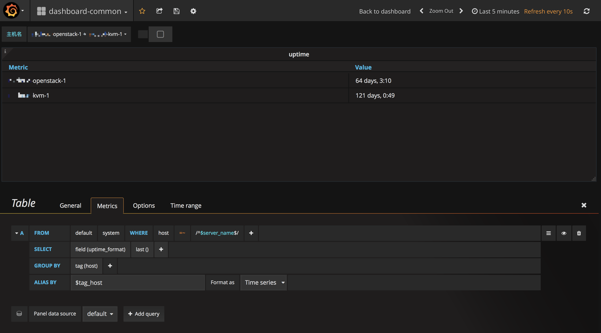

# 基本信息

## 系统运行时间
以表格的形式显示系统自启动以来的运行时间,当选择多个主机时,表格显示每个主机的系统运行时间。

数据源: system表中的uptime_format是以字符串表示的系统启动时间

如下图

配置，添加panel时，选择Table类型。

### General标签

* Title: 设为"uptime"
* Description: 设为"system uptime"

### Metrics标签
query editor设置:  

* FROM: 选择从system表拉取数据
* WHERE: 为了支持多个主机，设置为host等于主机名模板变量的值(模板变量的设置参考[Grafana Tutorial](https://monitor.frank6866.com/chapters/basic/monitor-basic-grafana-tutorial.html))
* SELECT: 选择"uptime_format"字段，并使用last这个选择函数，因为我们只关注最后一个值
* GROUP BY: 按照主机分组，设为tag(host)
* ALIAS BY: 设置为$tag_host，这样表格中的Metri列就会显示主机名

### Options标签

* Data: 将"Table Transform"设置为"Time series to rows"
* Column Styles: 将Time列设置为Hidden，就不会把时间显示出来；如果需要显示时间这一列，可以将Type设置为Date

