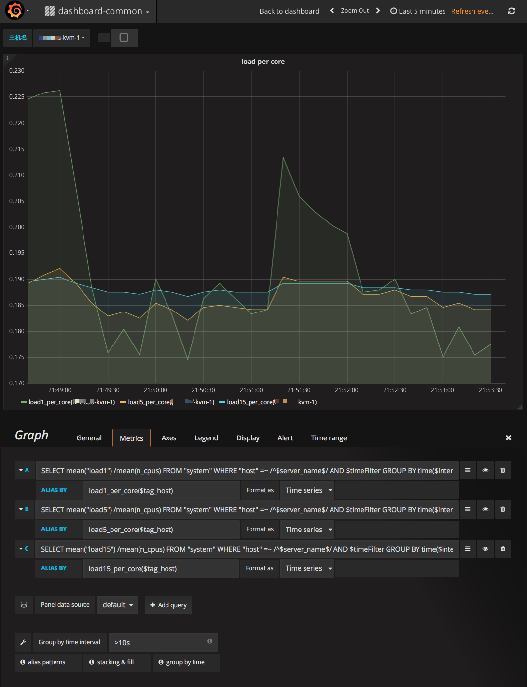
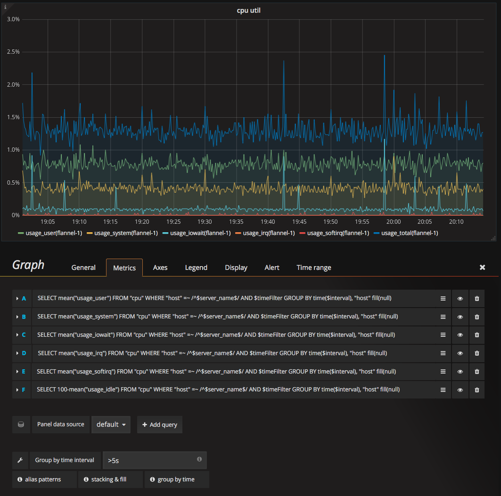

# CPU监控

## 每个核的平均负载
对于多核系统，load显示的是所有核的总负载，1个核的系统load为2时负载就有点高了，但是24核的系统load为12时系统的负载都不高，所以我们使用每个核的平均负载反应系统的负载情况。当每个核的平均负载大于1时，就需要注意了。

数据源: system表中的load1表示的是系统的所有核1分钟的平均负载，n_cpus表示系统逻辑cpu的个数(查看系统的cpu信息参考[这里](https://frank6866.gitbooks.io/linux/content/chapters/process/linux-process-cpu-info.html))。使用load1/n\_cpus就可以得到系统1分钟内每个核的平均负载，5分钟和15分钟计算方法是一样的。

如下图:

添加panel时，选择Graph类型。

### General标签

* Title: 设为"load per core"
* Description: 设为"system load average per core"

### Metrics标签
query editor设置(load1,load5和load15的配置类似，以load1为例):

由于在SELECT语句中使用了两个字段相除，选择模式不支持，所以点击"Toggle Edit Mode"进入输入模式，查询语句如下:

> SELECT mean("load1") /mean(n_cpus) FROM "system" WHERE "host" =~ /^$server_name$/ AND $timeFilter GROUP BY time($interval), "host" fill(null)

ALIAS BY设置为$tag_host

## CPU利用率监控
数据源: cpu表中的相关使用率信息.

配置如下图:  

