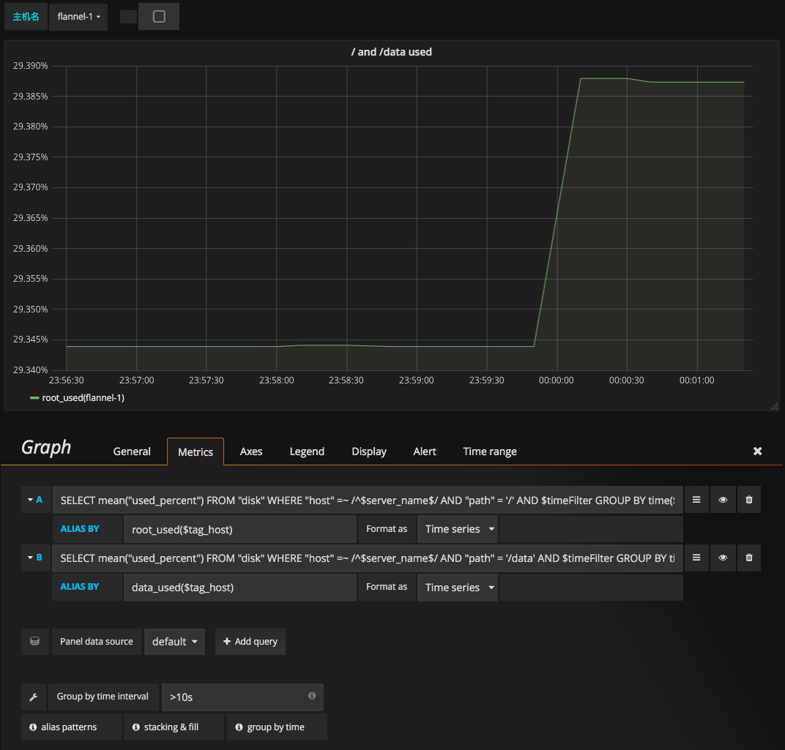
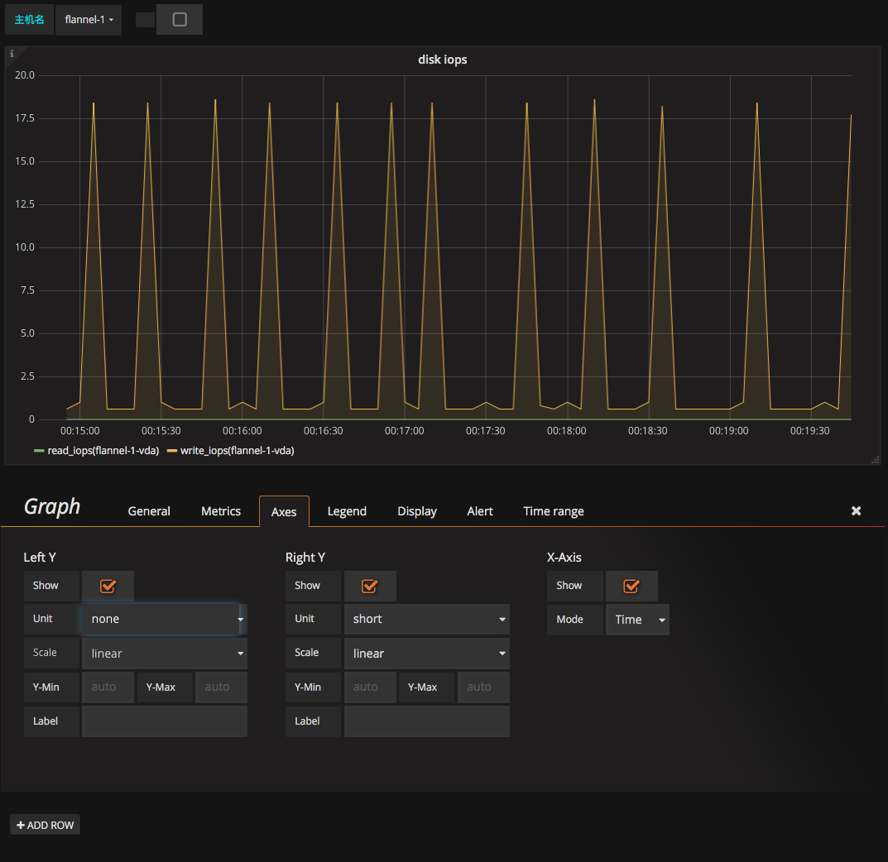
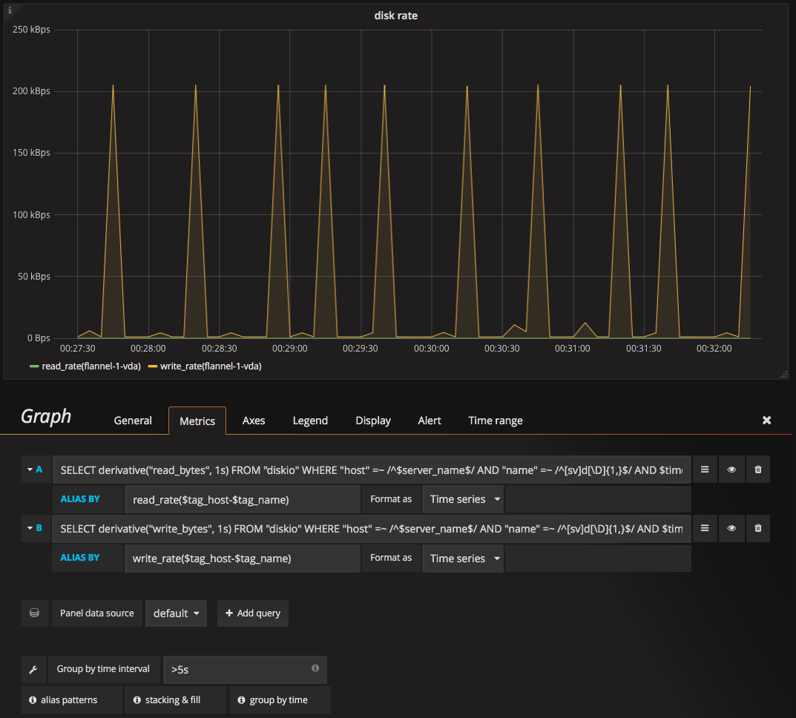

# 磁盘监控
* 使用量监控
* 读写速度监控
* IOPS监控
* disk util监控
* inode用量

## disk util
```
SELECT derivative("io_time", 1ms) FROM "diskio" WHERE "host" =~ /^$host$/ AND $timeFilter GROUP BY "name"
```

## inode用量
```
SELECT mean("inodes_used")/mean("inodes_total") FROM "disk" WHERE ("host" =~ /$machine$/) AND $timeFilter GROUP BY time($interval), "host", "path" fill(null)
```

## 磁盘用量监控
目的: 监控根分区/和数据分区/data的使用空间百分比。

数据源: disk表中的used_percent字段。

添加panel时，选择Graph类型。

### General标签
* Title: 设为"/ and /data used"
* Description: 设为"根分区和数据分区用量"


### Metrics标签
根分区/用量的查询语句为:  

> SELECT mean("used_percent") FROM "disk" WHERE "host" =~ /^$server_name$/ AND "path" = '/' AND $timeFilter GROUP BY time($interval), "host" fill(null)

ALIAS BY设置为**root\_used($tag\_host)**

数据分区/data用量的查询语句为:  

> SELECT mean("used_percent") FROM "disk" WHERE "host" =~ /^$server_name$/ AND "path" = '/data' AND $timeFilter GROUP BY time($interval), "host" fill(null)

ALIAS BY设置为**data\_used($tag_host)**

### Axes标签
在Axes中可以设置坐标轴的单位为:  

LeffY - Uint - none - percent(0-100)

如下图:  




## 磁盘读写IOPS监控
IOPS的计算方法参考[/proc/diskstats文件](https://frank6866.gitbooks.io/linux/content/chapters/io/linux-io-proc-diskstats.html).

目的: 监控磁盘的IOPS。

数据源: diskio表中的reads和writes字段。

添加panel时，选择Graph类型。

### General标签
* Title: 设为"disk iops"
* Description: 设为"磁盘读和写的IOPS"

### Metrics标签
read iops的查询语句为:  

> SELECT derivative("reads", 1s) FROM "diskio" WHERE "host" =~ /^$server_name$/ AND "name" =~ /^[sv]d[\D]{1,}$/ AND $timeFilter GROUP BY "host", "name" fill(null)

ALIAS BY设置为**read\_iops($tag\_host-$tag_name)**

write iops的查询语句为:  

> SELECT derivative("writes", 1s) FROM "diskio" WHERE "host" =~ /^$server_name$/ AND "name" =~ /^[sv]d[\D]{1,}$/ AND $timeFilter GROUP BY "host", "name" fill(null)

ALIAS BY设置为**write\_iops($tag\_host-$tag_name)**

### Axes标签
在Axes中可以设置坐标轴的单位为:  

LeffY - Uint - none - none

如下图:  




## 磁盘读写速度监控
IOPS的计算方法参考[/proc/diskstats文件](https://frank6866.gitbooks.io/linux/content/chapters/io/linux-io-proc-diskstats.html).

目的: 监控磁盘的读写速度。  

数据源: diskio表中的read\_bytes和write\_bytes字段。

添加panel时，选择Graph类型。

### General标签
* Title: 设为"disk rate"
* Description: 设为"磁盘读和写的速度"

### Metrics标签
read rate的查询语句为:  

> SELECT derivative("read_bytes", 1s) FROM "diskio" WHERE "host" =~ /^$server_name$/ AND "name" =~ /^[sv]d[\D]{1,}$/ AND $timeFilter GROUP BY "host", "name"

ALIAS BY设置为**read\_rate($tag_host-$tag\_name)**

write rate的查询语句为:  

> SELECT derivative("write_bytes", 1s) FROM "diskio" WHERE "host" =~ /^$server_name$/ AND "name" =~ /^[sv]d[\D]{1,}$/ AND $timeFilter GROUP BY "host", "name"

ALIAS BY设置为**write\_rate($tag_host-$tag\_name)**

### Axes标签
在Axes中可以设置坐标轴的单位为:  

LeffY - Uint - date rate - bytes/sec

如下图:  




