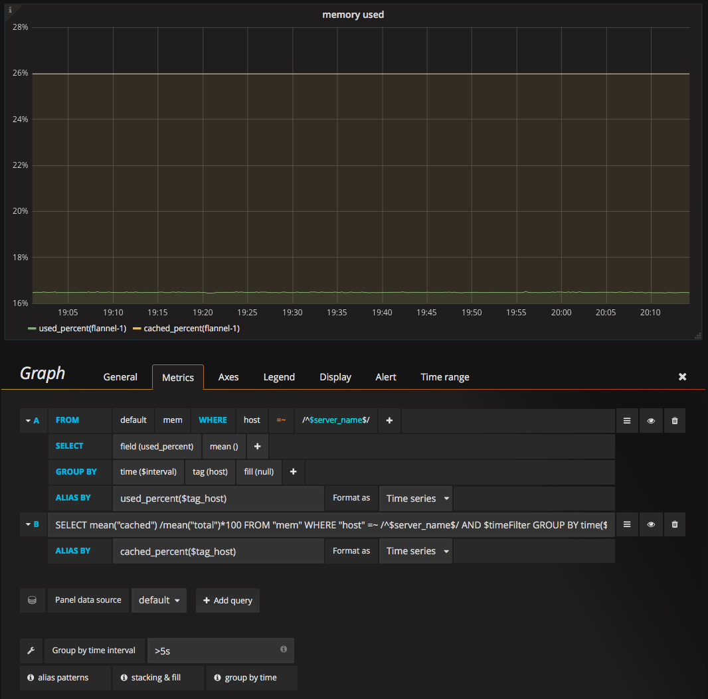

# 内存监控
监控项:  

* 已用内存百分比
* cached占总内存的百分比

数据源: mem表中的used_percent、cached和total字段。  

如下图:  

### General标签

* Title: 设为"memory used"
* Description: 设为"内存使用率"

### Metrics标签
已有内存百分比的查询语句如下:  

> SELECT mean("used_percent") FROM "mem" WHERE "host" =~ /^$server_name$/ AND $timeFilter GROUP BY time($interval), "host" fill(null)

cached占总内存的百分比如下:  

> SELECT mean("cached") /mean("total")*100 FROM "mem" WHERE "host" =~ /^$server_name$/ AND $timeFilter GROUP BY time($interval), "host" fill(null)

### Axes标签
在Axes中可以设置坐标轴的单位:  

LeffY - Uint - none - percent(0-100)

