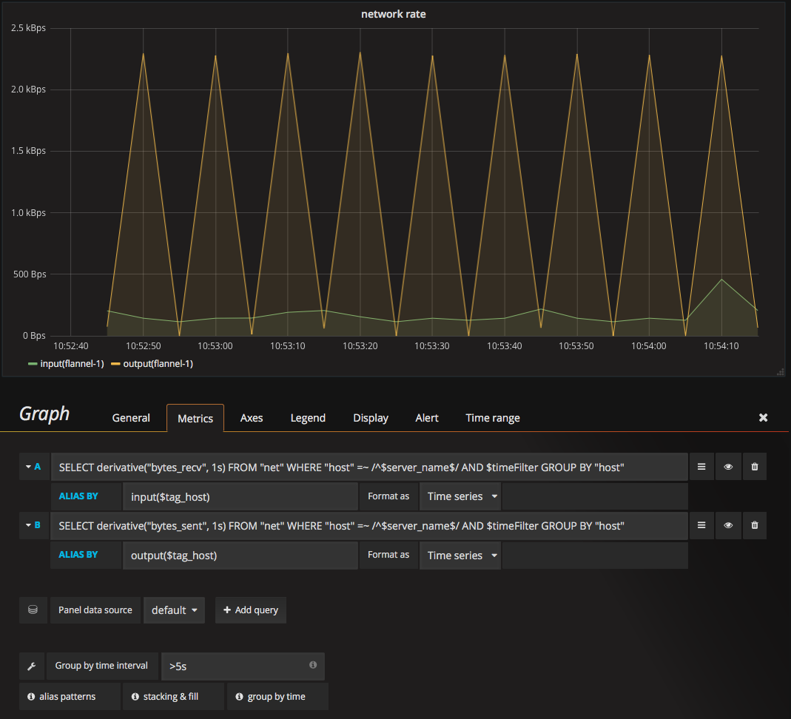
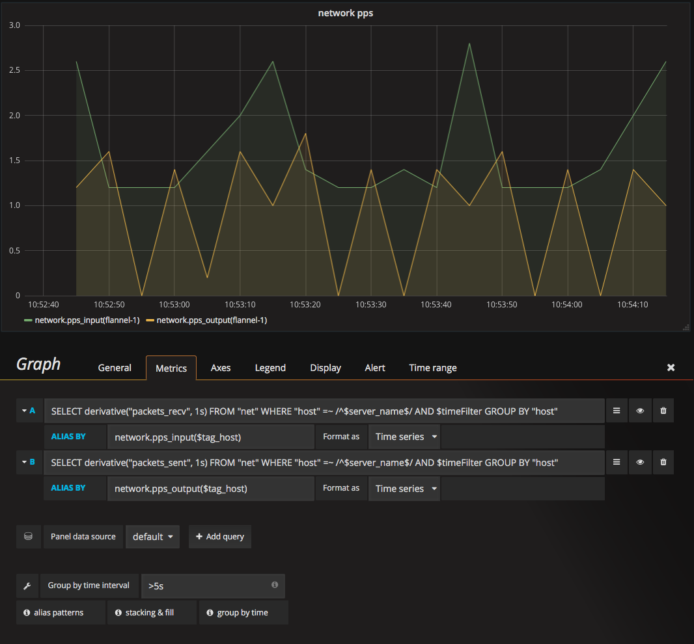
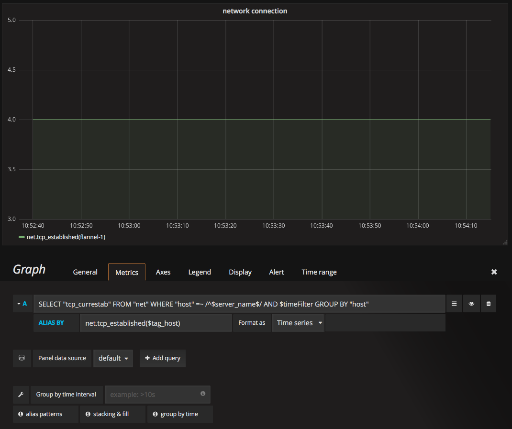

# 网络监控

## 网速监控
网速数据来自net表中的bytes\_recv和bytes\_sent字段。

### Metrics标签
input流量监控的查询语句:  

> SELECT derivative("bytes_recv", 1s) FROM "net" WHERE "host" =~ /^$server_name$/ AND $timeFilter GROUP BY "host"

output流量监控的查询语句:   

> SELECT derivative("bytes_sent", 1s) FROM "net" WHERE "host" =~ /^$server_name$/ AND $timeFilter GROUP BY "host"

### Axes标签
在Axes中可以设置坐标轴的单位为:  

LeffY - Uint - date rate - bytes/sec

如下图:  

## pps监控
pps数据来自net表中的packets\_recv和packets\_sent字段。

### Metrics标签
input pps监控的查询语句:  

> SELECT derivative("packets_recv", 1s) FROM "net" WHERE "host" =~ /^$server_name$/ AND $timeFilter GROUP BY "host"

output pps监控的查询语句:   

> SELECT derivative("packets_sent", 1s) FROM "net" WHERE "host" =~ /^$server_name$/ AND $timeFilter GROUP BY "host"

### Axes标签
在Axes中可以设置坐标轴的单位为:  

LeffY - Uint - node - none

如下图:  

## tcp连接数监控
tcp连接数来自net表中的tcp\_currestab字段。  

### Metrics标签
tcp连接数监控的查询语句:  

> SELECT "tcp_currestab" FROM "net" WHERE "host" =~ /^$server_name$/ AND $timeFilter GROUP BY "host"

### Axes标签
在Axes中可以设置坐标轴的单位为:  

LeffY - Uint - node - none

如下图:  

