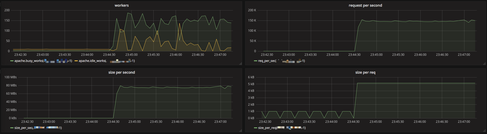

# apache/httpd监控
apache需要开启server-status模块，才可以采集监控数据(参考[apache启用server-status](https://frank6866.gitbooks.io/linux/content/chapters/software/linux-httpd.html)).

## 数据源
apache的监控数据存储在telegraf库的apache表中，如下:  

```
> show field keys on telegraf from apache
name: apache
fieldKey             fieldType
--------             ---------
BusyWorkers          float
BytesPerReq          float
BytesPerSec          float
CPULoad              float
IdleWorkers          float
ReqPerSec            float
TotalAccesses        float
TotalkBytes          float
Uptime               float
scboard_closing      float
scboard_dnslookup    float
scboard_finishing    float
scboard_idle_cleanup float
scboard_keepalive    float
scboard_logging      float
scboard_open         float
scboard_reading      float
scboard_sending      float
scboard_starting     float
scboard_waiting      float
```

### 示例数据
```
# telegraf --input-filter apache -test
......
scboard_reading=0,TotalAccesses=6015163,CPULoad=1.80276,
scboard_sending=1,scboard_open=245,scboard_dnslookup=0,
BytesPerSec=1412750,BytesPerReq=5263.07,IdleWorkers=9,scboard_starting=0,
scboard_keepalive=1,scboard_finishing=0,scboard_idle_cleanup=0,
ReqPerSec=268.426,BusyWorkers=2,scboard_closing=0,
scboard_logging=0,TotalkBytes=30916230,Uptime=22409,
scboard_waiting=9 1495293442000000000
```

### 字段说明

* BusyWorkers: 表示正在工作的进程数
* IdleWorkers: 表示空闲的进程数(BusyWorkers+IdleWorkers和ps -f -u apache | wc -l命令的输出是一样的)
* BytesPerReq: 表示每个请求响应的大小，是从服务启动时间开始算的
* BytesPerSec: 表示每秒请求响应的总大小，是从服务启动时间开始算的
* TotalAccesses: 总的访问次数(用来计算每秒请求数)
* TotalkBytes: 总数据量(用来计算每秒数据量的大小)


## 监控配置
### worker数量监控
**数据源为BusyWorkers字段和IdleWorkers字段.**

1.busyworker的查询语句如下:  

> SELECT mean("BusyWorkers") FROM "apache" WHERE "host" =~ /^$server_name$/ AND $timeFilter GROUP BY time($interval), "host" fill(null)

2.idelworker的查询语句如下:  

> SELECT mean("IdleWorkers") FROM "apache" WHERE "host" =~ /^$server_name$/ AND $timeFilter GROUP BY time($interval), "host" fill(null)

### 每秒请求数监控
**数据源为TotalAccesses字段.**

每秒请求数的查询语句如下:  

> SELECT derivative("TotalAccesses", 1s) FROM "apache" WHERE "host" =~ /^$server_name$/ AND $timeFilter GROUP BY "host"


### 每秒总请求大小监控
**数据源为TotalkBytes字段.**

查询语句如下，注意单位是KB/s: 

> SELECT derivative("TotalkBytes", 1s) FROM "apache" WHERE "host" =~ /^$server_name$/ AND $timeFilter GROUP BY "host"


### 每次请求的数据大小监控
**数据源为TotalAccesses字段和TotalkBytes字段.**

查询语句如下，注意单位是KB: 

> SELECT derivative("TotalkBytes", 1s)/derivative("TotalAccesses", 1s) FROM "apache" WHERE "host" =~ /^$server_name$/ AND $timeFilter GROUP BY "host"


监控配置完后，使用[ab](https://frank6866.gitbooks.io/linux/content/chapters/network/network-ab.html)开1000个并发压测了一把，效果图如下:  




