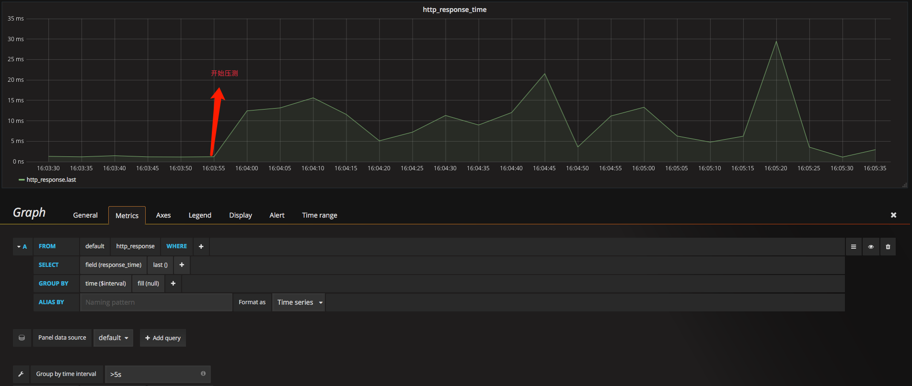

# http响应时间监控


## 数据源
apache的监控数据存储在telegraf库的http_response表中，如下:  

```
> show field keys on telegraf from http_response
name: http_response
fieldKey           fieldType
--------           ---------
http_response_code integer
response_time      float
```

### 示例数据
```
# telegraf --input-filter http_response --test
* Plugin: inputs.http_response, Collection 1
> http_response,server=http://10.10.10.10,method=GET,host=xxx, 
response_time=0.0011195200000000002,http_response_code=403i
1495353263000000000
```

### 字段说明

* http\_response\_code: 响应码
* response_time: 响应时间，单位为秒


## 监控配置
响应时间的查询语句如下:  

> SELECT last("response\_time") FROM "http\_response" WHERE $timeFilter GROUP BY time($interval) fill(null)


使用ab -c 1000 -n 1000000 url压测httpd后，可以看到响应时间明显上升。如下图:  





